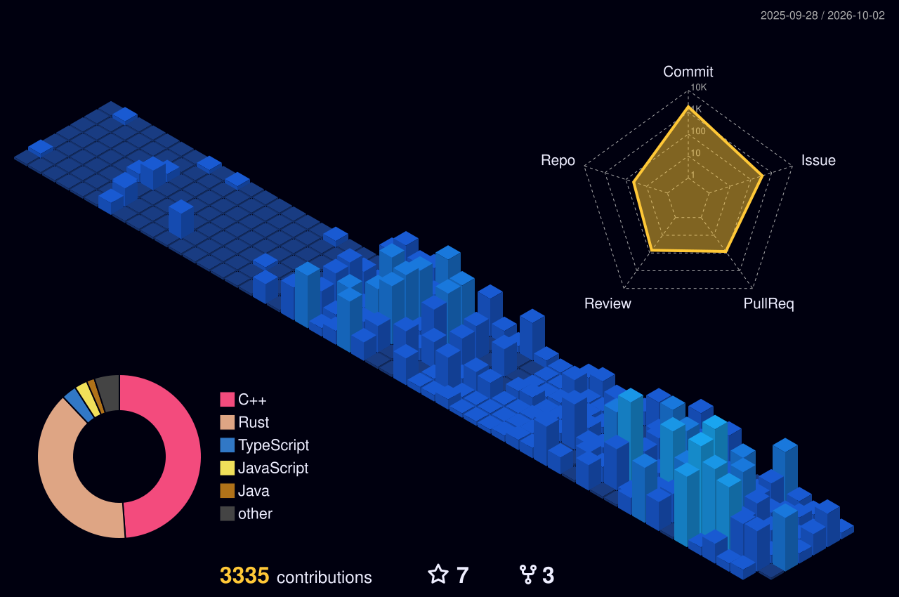

# Hey, I'm Canberk

**Graphics, game AI, and systems programmer.**
C++ · Rust · Vulkan · DirectX 11/12 · OpenGL · CUDA · Unreal Engine 5

  
  
  

I like knowing how things work all the way down, so I build them from scratch:
a game engine with four graphics backends, a deep learning library with its own
CUDA kernels, a game AI plugin for Unreal. Most of what's here is meant to be
read as much as used.

## What I'm building

<table>
<tr>
<td width="33%" valign="top">

<b><a href="https://github.com/CanReader/SleakEngine">SleakEngine</a></b> 
C++23 engine with DirectX 11, DirectX 12, OpenGL and Vulkan behind one rendering interface. <a href="https://github.com/CanReader/SleakCraft">SleakCraft</a> is a voxel sandbox built on it.
</td>
<td width="33%" valign="top">

<b><a href="https://github.com/CanReader/RustVK">RustVK</a></b> 
A modular Vulkan renderer in Rust on raw <code>ash</code> bindings. No wrappers between me and the spec.
</td>
<td width="33%" valign="top">

<b><a href="https://github.com/CanReader/NavLab">NavLab</a></b> 
Pathfinding you can watch: A*, jump point search, flow fields, and a polygon navmesh with funnel smoothing.
</td>
</tr>
</table>

| Project | What it is |
|---|---|
| [**Tactix**](https://github.com/CanReader/Tactix) | Game AI plugin for Unreal Engine 5: Utility AI, GOAP, HTN, cover, influence maps, squads and formations |
| [**FastNN**](https://github.com/CanReader/FastNN) | Deep learning library in Rust with CUDA kernels. Autograd, transformers, KV-cached generation, all from scratch. [Try it in the browser](https://github.com/CanReader/fastnn-visualizer) |
| [**ViewCam**](https://github.com/CanReader/ViewCam-Desktop) | Turns your phone into a wireless webcam. Qt 6 desktop app plus an Android client |
| [**StealthDemo**](https://github.com/CanReader/StealthDemo) | Stealth enemy AI in UE5 with behavior trees, services and C++ tasks |
| [**Evo-Engine**](https://github.com/CanReader/Evo-Engine) | Evolutionary computation in Rust: GA, DE, CMA-ES, NSGA-II, island models |
| [**raft-kv**](https://github.com/CanReader/raft-kv) | Distributed key-value store on Raft, with gRPC and RocksDB |
| [**rustfm**](https://github.com/CanReader/rustfm) · [**ZipRS**](https://github.com/CanReader/ZipRS) | A terminal file manager and a desktop archive manager, both in Rust |

## Worth bookmarking

- [**game-ai-cheatsheet**](https://github.com/CanReader/game-ai-cheatsheet): which game AI technique to use and why. FSMs, behavior trees, utility AI, GOAP, HTN, steering, A*, JPS, flow fields, navmeshes and influence maps, each with a small tested implementation.
- [**graphics-interview-questions**](https://github.com/CanReader/graphics-interview-questions): 192 graphics, rendering and engine programming questions with short answers that explain why.

## Want to contribute?

[FastNN](https://github.com/CanReader/FastNN) is part of Hacktoberfest this year.
The issues labelled [`good first issue`](https://github.com/CanReader/FastNN/issues?q=is%3Aopen+label%3A%22good+first+issue%22)
each point at the exact file and line and say what a fix looks like, and most
don't need a GPU. [Start here](https://github.com/CanReader/FastNN/issues/56).

## Tools I use

 
 
&nbsp;

## I use Arch, btw

  
   
  Arch + Hyprland.

## Stats

<picture>
  <source media="(prefers-color-scheme: dark)" srcset="./profile-3d-contrib/profile-night-view.svg">
  <source media="(prefers-color-scheme: light)" srcset="./profile-3d-contrib/profile-season-animate.svg">
  
</picture>

